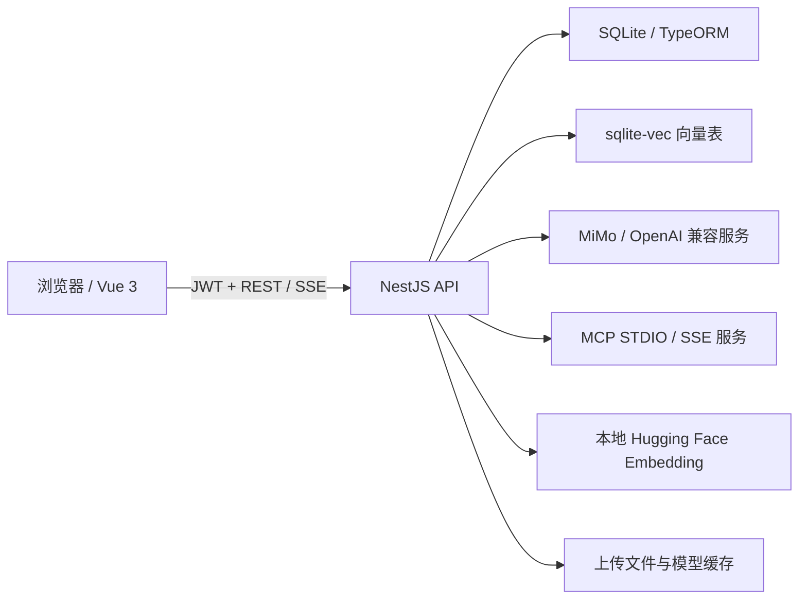

# MiMo 智能平台

一个面向个人与团队使用的 AI 全栈平台。项目以前端 Vue 3 和后端 NestJS 为基础，通过统一后端代理接入小米 MiMo 及其他 OpenAI Chat Completions 兼容服务，提供智能对话、可视化智能体工作流、MCP 工具调用、RAG 知识库、TTS 语音合成和后台管理能力。


## 功能概览

| 模块 | 已实现能力 |
| --- | --- |
| **智能助手** | SSE 流式对话、会话持久化、Markdown 与代码高亮、多模态附件、深度思考、联网搜索、函数调用、角色设定、知识库关联 |
| **可视化智能体** | 基于 Vue Flow 的工作流编辑器，支持草稿自动保存、图校验、流式调试、版本发布以及在正式会话中运行已发布版本 |
| **MCP 工具** | STDIO / SSE 两种传输方式，工具发现与缓存、连接健康检查、敏感参数加密、聊天 ReAct 调用和工作流节点调用 |
| **RAG 知识库** | 文档上传与异步处理、可配置文本切分、本地 Embedding、多模型切换、sqlite-vec 向量检索、分片查看与引用信息 |
| **TTS 合成** | 预置音色、文本音色设计、音频音色复刻，支持风格描述/标签、流式合成、WAV/PCM16/MP3 和历史记录 |
| **用户与权限** | 注册登录、JWT 鉴权、个人资料与密码修改、头像上传、`admin` / `user` RBAC，第一个注册用户自动成为管理员 |
| **后台管理** | 用户、角色、登录日志、操作日志、系统配置、聊天配置、音频标签、会话审计和 ECharts 统计面板 |

## 核心功能

### 1. 智能助手

- 使用原生 `fetch + ReadableStream` 消费后端 SSE，实时展示回答、思考过程与工具调用轨迹。
- 会话和消息按用户持久化到 SQLite，可创建、重命名、删除和继续历史会话。
- 从当前 AI 服务商的 `/models` 接口动态读取模型列表；读取失败时仍可手动输入模型名。
- 支持文本、图片、音频和视频消息内容。
- 可按管理员开关使用：
  - 深度思考
  - 联网搜索
  - 函数调用
  - 模型角色设定（预设角色或自定义提示词）
  - RAG 知识库
- 启用 MCP 后，聊天进入工具调用循环，由模型选择并执行当前用户已启用的 MCP 工具。
- 创建智能体会话时会绑定已发布的智能体版本，后续重新发布不会改变已有会话的执行快照。

### 2. 可视化智能体工作流

智能体编辑器提供以下节点：

| 节点 | 作用 |
| --- | --- |
| **开始** | 提供用户问题、会话历史等系统变量 |
| **大模型** | 调用指定模型，可设置系统提示词、提示词模板、温度、最大 Token 和历史轮数 |
| **知识库** | 使用查询模板检索指定知识库并输出上下文及引用 |
| **MCP 工具** | 选择 MCP 服务和工具，按字面量、变量或模板绑定工具参数 |
| **模板** | 使用 `{{变量}}` 组合上游节点输出 |
| **条件** | 按相等、包含、空值、存在性和数值比较等规则进行真假分支 |
| **回答** | 生成最终回复并结束当前执行路径 |

工作流支持：

- 画布拖拽、连线、节点复制与删除。
- 草稿自动保存和离开页面前保存保护。
- 发布前静态校验，包括节点配置、连通性、变量引用、条件分支和 MCP 参数 Schema。
- 独立调试面板；调试结果以 SSE 事件流返回，且不会写入正式聊天记录。
- 发布生成不可变版本快照，正式聊天仅运行已发布版本。

### 3. MCP 工具调用

- 支持本地进程 `stdio` 和远程服务 `sse`。
- 支持配置命令、参数、环境变量、URL 和请求头。
- 可启用/禁用服务器，手动刷新工具列表并查看连接健康状态。
- 工具定义缓存到数据库，编辑智能体时可直接读取工具 JSON Schema 构建参数表单。
- `env` 和 `headers` 中名称包含 `key`、`token`、`secret`、`password`、`api`、`auth`、`credential`、`private` 的字段会加密保存，并在返回前端时显示为 `***`。
- MCP 工具既可用于普通聊天的模型工具调用，也可作为智能体工作流中的确定性节点使用。

> STDIO MCP 会由后端启动本地子进程。请只配置可信命令，并确保运行后端的系统已安装对应运行时或可执行文件。

### 4. RAG 知识库

处理流程：

1. 上传 PDF、Word、Excel、CSV 或文本文件。
2. 使用 `RecursiveCharacterTextSplitter` 切分文档。
3. 通过 `@huggingface/transformers` 在本地生成 Embedding。
4. 使用 `sqlite-vec` 为每个知识库建立独立向量表。
5. 聊天或智能体节点查询时执行向量相似度检索，并将相关上下文注入模型。

每个知识库可以独立配置：

- Embedding 模型
- `chunkSize`，默认 `500`
- `chunkOverlap`，默认 `100`
- `embeddingBatchSize`，默认 `8`

当前内置模型：

| 模型 | 向量维度 |
| --- | ---: |
| `Xenova/all-MiniLM-L6-v2` | 384 |
| `Xenova/all-mpnet-base-v2` | 768 |
| `Xenova/bge-small-en-v1.5` | 384 |
| `Xenova/gte-small` | 384 |
| `Xenova/multilingual-e5-small` | 384 |

切换 Embedding 模型或修改影响切分结果的参数后，已有文档会重新处理。模型首次使用时需要从 Hugging Face 下载，之后使用本地缓存。

### 5. TTS 语音合成

| 模式 | 模型 | 说明 |
| --- | --- | --- |
| **预置音色** | `mimo-v2.5-tts` | 使用内置精品音色生成语音 |
| **音色设计** | `mimo-v2.5-tts-voicedesign` | 通过自然语言描述设计音色 |
| **音色复刻** | `mimo-v2.5-tts-voiceclone` | 上传音频样本复刻音色 |

预置音色包括：MiMo-默认、冰糖、茉莉、苏打、白桦、Mia、Chloe、Milo、Dean。

其他能力：

- 自然语言风格描述或后台维护的音频标签。
- `wav`、`pcm16`、`mp3` 输出格式。
- 普通生成与 SSE 流式生成接口。
- 合成历史保存到数据库，包含音频 Base64，可在页面刷新后重建播放地址。
- 音频播放统一使用 `new Audio()`，避免浏览器或插件误判 `<audio>` 对 Blob URL 的预加载行为。

### 6. 多服务商兼容

API 设置内置以下 Base URL 预设：

- 小米 MiMo 普通 API
- 小米 MiMo Token Plan：中国、新加坡、欧洲
- OpenAI
- DeepSeek
- 阿里云百炼 / 通义千问：中国站、国际站
- Moonshot / Kimi
- 智谱 GLM
- OpenRouter
- SiliconFlow
- 自定义 OpenAI 兼容接口

鉴权方式支持自动判断、`Authorization: Bearer`、`api-key`、`x-api-key` 和无鉴权。本项目的 TTS、MiMo 深度思考及 MiMo 联网搜索等扩展能力仍取决于目标服务商是否兼容对应参数。

> MiMo Token Plan 不支持 `mimo-v2-flash` 和 `web_search`。前后端会进行兼容性限制，请改用支持的模型、关闭联网搜索或切换其他端点。

## 技术架构



### 前端

| 技术 | 用途 |
| --- | --- |
| Vue 3 + `<script setup>` | 页面与组件 |
| TypeScript 6 | 严格类型检查 |
| Vite 8 | 开发服务器与构建 |
| Element Plus + Tailwind CSS 4 | UI 与样式 |
| Pinia + Vue Router | 状态管理与路由 |
| Vue Flow | 智能体工作流画布 |
| Axios + Fetch Streams | REST 请求与 SSE 流式响应 |
| marked + DOMPurify + highlight.js | Markdown、安全清洗和代码高亮 |
| ECharts | 后台统计图表 |
| Web Crypto API | AES-GCM 敏感请求加密 |

### 后端

| 技术 | 用途 |
| --- | --- |
| NestJS 11 | API、鉴权、模块化服务 |
| TypeScript 5.7 | 后端开发 |
| TypeORM + better-sqlite3 | 数据持久化 |
| sqlite-vec | 向量检索 |
| `@huggingface/transformers` + ONNX Runtime | 本地 Embedding |
| `@langchain/textsplitters` | 文档切分 |
| Model Context Protocol SDK | MCP 客户端与工具调用 |
| Passport JWT + bcryptjs | 身份认证与密码哈希 |
| pdf-parse + mammoth + exceljs | 文档解析 |

## 快速开始

### 环境要求

- Node.js **22 或更高版本**
- pnpm **10.24.x**，建议通过 Corepack 启用
- 原生模块编译环境：
  - Windows：Visual Studio Build Tools（含 C++ 工具链）
  - Debian / Ubuntu：`build-essential python3 make g++`

项目使用 `better-sqlite3`、`sqlite-vec` 和 `onnxruntime-node`，低版本 Node.js 或缺少原生编译工具时可能安装失败。

### 1. 安装依赖

```bash
corepack enable
pnpm install
```

仓库使用 pnpm workspace，根目录命令会同时安装前端和 `server/` 的依赖。

### 2. 配置环境变量

在项目根目录创建 `.env`：

```env
# NestJS 后端地址
VITE_BACKEND_URL=http://localhost:3001

# 必须与 server/.env 中的 AES_SECRET_KEY 完全一致
VITE_AES_SECRET_KEY=replace-with-a-strong-random-secret
```

在 `server/` 创建 `.env`：

```env
PORT=3001
CORS_ORIGIN=http://localhost:3000

# 与前端 VITE_AES_SECRET_KEY 保持一致
AES_SECRET_KEY=replace-with-a-strong-random-secret

# JWT 签名密钥
JWT_SECRET=replace-with-another-strong-random-secret

# 可选：Hugging Face 镜像及模型缓存目录
# HF_ENDPOINT=https://hf-mirror.com/
# TRANSFORMERS_CACHE=./models/transformers
```

| 变量 | 必需 | 默认值 | 说明 |
| --- | --- | --- | --- |
| `VITE_BACKEND_URL` | 否 | `http://localhost:3001` | 前端访问的后端地址 |
| `VITE_AES_SECRET_KEY` | 是 | 无 | 前端敏感请求加密密钥 |
| `PORT` | 否 | `3001` | 后端监听端口 |
| `CORS_ORIGIN` | 否 | `http://localhost:3000` | 允许的前端来源，多个来源用逗号分隔 |
| `AES_SECRET_KEY` | 是 | 无 | 后端 AES 密钥，必须与前端一致 |
| `JWT_SECRET` | 是 | 无 | JWT 签名密钥 |
| `HF_ENDPOINT` | 否 | Hugging Face 官方地址 | 模型下载镜像地址 |
| `TRANSFORMERS_CACHE` | 否 | `./models/transformers` | Embedding 模型缓存目录 |

> MiMo 或其他服务商的 API Key 不通过环境变量配置。登录后在右上角“API 设置”中填写，后端会使用 AES-GCM 加密后保存到当前用户的数据库配置中。

### 3. 启动开发环境

```bash
# 同时启动前端 3000 和后端 3001
pnpm dev:all
```

也可以分别启动：

```bash
pnpm dev
pnpm -C server start:dev
```

打开 `http://localhost:3000`。数据库和默认配置会在后端首次启动时自动创建；第一个注册用户会成为管理员。

### 4. 初次使用

1. 注册第一个账号并登录。
2. 在“API 设置”中选择服务商、填写 API Key 和鉴权方式。
3. 进入“智能助手”选择或输入模型后开始对话。
4. 如需 RAG，先创建知识库并等待文档处理完成。
5. 如需工具调用，先添加并启用 MCP 服务器，再在聊天或智能体工作流中使用。
6. 如需自定义智能体，创建工作流、校验、调试并发布，然后从智能体列表发起会话。

## 常用命令

```bash
# 开发
pnpm dev                         # 仅前端
pnpm -C server start:dev         # 仅后端
pnpm dev:all                     # 前后端同时启动

# 构建
pnpm build                       # 前端类型检查并构建
pnpm -C server build             # 后端构建
pnpm build:all                   # 构建前后端

# 测试与检查
pnpm test                        # 前端 Vitest
pnpm typecheck                   # 前端独立类型检查
pnpm -C server test              # 后端 Jest
pnpm -C server test:cov          # 后端测试覆盖率
pnpm -C server format            # 后端 Prettier

# 生产启动
pnpm -C server start:prod
pnpm preview                     # 本地预览前端 dist
```

生产构建产物位于：

- 前端：`dist/`
- 后端：`server/dist/`

实际部署时请使用 Nginx、Caddy 或其他静态服务器托管前端，并将 `/api` 请求转发到 NestJS 后端。

## 项目结构

```text
TTS-Project/
├─ src/                          # Vue 3 前端
│  ├─ api/                       # REST 与 SSE API 封装
│  ├─ components/                # 聊天、TTS、音频及工作流组件
│  ├─ composables/               # TTS、页面数据等组合式逻辑
│  ├─ router/                    # 路由与权限守卫
│  ├─ stores/                    # Pinia 状态管理
│  ├─ types/                     # 前端类型定义
│  ├─ utils/                     # 加密、音频、工作流与流解析工具
│  └─ views/                     # 助手、智能体、知识库、MCP、TTS、后台页面
├─ server/
│  ├─ src/
│  │  ├─ agent/                  # 智能体、版本、图校验与工作流执行器
│  │  ├─ auth/                   # 注册、登录与 JWT 鉴权
│  │  ├─ chat/                   # 会话、SSE 对话、MCP Agent
│  │  ├─ knowledge-base/         # 文档处理、Embedding、RAG、sqlite-vec
│  │  ├─ mcp/                    # MCP 配置、连接与工具服务
│  │  ├─ tts/                    # TTS 代理与流式合成
│  │  ├─ admin/                  # 用户、日志、聊天审计与统计
│  │  ├─ config/                 # 用户 API 与 TTS 配置
│  │  ├─ common/                 # 加密、异常过滤器、守卫、上传和拦截器
│  │  └─ ...                     # 用户、角色、音频标签、系统配置等模块
│  ├─ public/uploads/            # 上传文件
│  ├─ models/transformers/       # 默认 Embedding 模型缓存
│  └─ data.sqlite                # 默认 SQLite 数据库
├─ public/                       # 前端静态资源
├─ .github/workflows/            # CI 与 Release 工作流
├─ pnpm-workspace.yaml
└─ package.json
```

## 安全与数据说明

- 所有外部 AI、TTS 和 MCP 请求均由后端发起，浏览器不直接调用模型服务。
- 登录、注册、个人资料和密码修改等敏感请求使用 AES-256-GCM，格式为 `iv:authTag:ciphertext`；后端仍兼容旧版 AES-CBC 两段格式。
- API Key 以 AES-GCM 密文保存到 SQLite；前端必须与后端使用相同的 AES 密钥。
- 用户密码使用 bcrypt 哈希保存。
- JWT 默认有效期为 7 天，当前实现为单 Access Token 模式。
- 管理接口使用 `@Roles('admin')` 和 `RolesGuard` 保护。
- 后端为每个请求生成或透传 `X-Request-Id`，全局异常响应包含请求标识，便于排查。
- 管理操作通过全局拦截器写入操作日志，敏感字段会进行脱敏。
- 当前数据库配置使用 `synchronize: true` 自动同步 Entity，适合开发环境；正式生产使用前应评估迁移方案并做好 `server/data.sqlite` 备份。

## API 概览

所有后端路由均带 `/api` 前缀，除注册、登录和公开配置外，大部分接口需要：

```http
Authorization: Bearer <JWT>
```

| 路由组 | 说明 |
| --- | --- |
| `/api/auth/*` | 注册、登录、当前用户、资料和密码 |
| `/api/config` | 当前用户的 API / TTS 配置 |
| `/api/chat/*` | 会话、消息、模型查询和 SSE 对话 |
| `/api/agents/*` | 智能体 CRUD、草稿、校验、发布和调试 |
| `/api/mcp/servers/*` | MCP 服务器管理、工具刷新和健康检查 |
| `/api/knowledge-base/*` | 知识库、文档、分片、模型和切分配置 |
| `/api/tts/generate` | 非流式 TTS |
| `/api/tts/generate-stream` | SSE 流式 TTS |
| `/api/history/*` | TTS 历史记录 |
| `/api/upload/*` | 头像和通用文件上传 |
| `/api/admin/*` | 后台用户、日志、统计和聊天审计 |
| `/api/admin/roles` | 角色管理 |
| `/api/admin/system-config` | 系统配置 |
| `/api/admin/chat-config` | 聊天模型兼容配置和功能开关 |

## 测试与 CI/CD

- 前端测试：Vitest + jsdom，覆盖工作流图处理和智能体 SSE 事件解析等工具逻辑。
- 后端测试：Jest，覆盖智能体图校验、工作流执行、智能体服务、聊天角色处理和全局异常过滤等逻辑。
- GitHub Actions CI 使用 Node.js 22 和 pnpm 10.24，在 `main` / `master` 的 push 与 pull request 上执行前后端构建及后端测试。
- 推送 `v*` 标签会触发 Release 工作流，构建前后端并生成 `release.zip`。

## 常见问题

### 登录或注册提示“请求数据解密失败”

检查根目录 `.env` 的 `VITE_AES_SECRET_KEY` 是否与 `server/.env` 的 `AES_SECRET_KEY` 完全一致。修改前端环境变量后需要重启 Vite。

### `better-sqlite3`、`sqlite-vec` 或 `onnxruntime-node` 安装失败

确认 Node.js 版本不低于 22，并安装本机 C/C++ 编译工具。切换 Node.js 大版本后建议重新执行 `pnpm install`。

### Embedding 模型下载缓慢或失败

可在 `server/.env` 中配置：

```env
HF_ENDPOINT=https://hf-mirror.com/
```

也可以通过 `TRANSFORMERS_CACHE` 指定已准备好的模型缓存目录。

### MCP 工具列表为空或调用无响应

- 确认 MCP 服务器已启用。
- STDIO 模式下确认命令可在后端运行环境中执行。
- SSE 模式下确认 URL、请求头和网络可达。
- 点击“刷新工具”重新发现工具，并查看健康检查结果。
- 编辑服务器配置后，旧连接会断开并在下次使用时重新建立。

### TTS 历史音频刷新后无法播放

新记录会保存 `audioBase64` 并在页面加载时重建 Blob URL。旧数据若只有临时 `audioUrl`，刷新后可能无法恢复。

### 删除 `data.sqlite` 后数据丢失

`server/data.sqlite` 保存用户、配置、聊天、知识库元数据、智能体和日志。删除后后端会重新建表并写入默认数据，但原有业务数据无法恢复。
